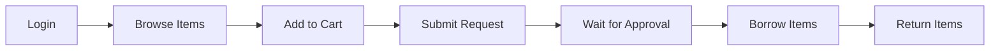

# 🍳 Cookery Borrowing System

<div align="center">


A modern desktop application for managing cookery item borrowing and inventory.

[Features](#-features) • [Installation](#-installation) • [Usage](#-usage) • [Database](#-database) • [Contributing](#-contributing)

</div>

---

## 📋 Overview

The **Cookery Borrowing System** is a comprehensive desktop application built with PyQt5 that streamlines the management of cookery items, utensils, and equipment. It provides a dual-interface system for both administrators and regular users to efficiently manage borrowing requests, inventory, and returns.

### ✨ Key Highlights

- 🎨 **Modern UI**: Clean and intuitive interface with custom styling
- 👥 **Role-Based Access**: Separate admin and user dashboards
- 🛒 **Shopping Cart System**: Easy item selection and request management
- 📊 **Real-Time Tracking**: Monitor borrowed items and request statuses
- 🔐 **Secure Authentication**: Password hashing with SHA-256

---

## 🚀 Features

### For Users
- ✅ Browse available cookery items by category (utensils, plates, glasses, etc.)
- 🛍️ Add items to cart and submit borrowing requests
- 📦 Track borrowed items and request status (pending/approved/rejected)
- 🔄 View borrowing history and return items
- 👤 Create and manage personal accounts

### For Administrators
- 📊 Dashboard with borrowing statistics and insights
- ➕ Add, edit, and delete cookery items
- 📋 Review and approve/reject borrowing requests
- 🔍 View all active and historical requests
- 📈 Monitor inventory levels and availability

---

## 🛠️ Installation

### Prerequisites

Before you begin, ensure you have the following installed:
- **Python 3.8+** ([Download](https://www.python.org/downloads/))
- **MySQL Server 8.0+** ([Download](https://dev.mysql.com/downloads/mysql/))
- **pip** (Python package manager)

### Step 1: Clone the Repository

```bash
git clone https://github.com/yourusername/CookeryBorrowingSystem.git
cd CookeryBorrowingSystem-main
```

### Step 2: Install Dependencies

```bash
pip install -r requirements.txt
```

**Required Packages:**
- PyQt5 (5.15.10)
- PyMySQL
- mysql-connector-python (8.4.0)
- mysqlclient (2.2.4)

### Step 3: Configure MySQL Database

1. **Start MySQL Server**
   ```bash
   # Windows
   net start MySQL80
   
   # Linux/Mac
   sudo systemctl start mysql
   ```

2. **Create Database**
   ```bash
   mysql -u root -p < models/database.sql
   ```
   
   Or manually execute:
   ```sql
   source models/database.sql;
   ```

3. **Update Database Credentials**
   
   Edit `models/database.py` and update the connection settings:
   ```python
   self.mydb = pymysql.connect(
       host="127.0.0.1",
       user="your_username",      # Change this
       password="your_password",  # Change this
       database="cookery_db",
       connect_timeout=5,
       autocommit=False
   )
   ```

### Step 4: Run the Application

```bash
python main.py
```

---

## 📖 Usage

### First Time Setup

1. **Launch the Application**
   ```bash
   python main.py
   ```

2. **Create Admin Account**
   - Click "Create Account" on the login screen
   - Fill in your details
   - The first account can be set as admin by manually updating the database

3. **Login**
   - Enter your credentials
   - Access your dashboard based on your role

### User Workflow



1. **Browse Items**: Navigate through different categories
2. **Add to Cart**: Select desired items and quantities
3. **Submit Request**: Send borrowing request to admin
4. **Track Status**: Monitor request approval status
5. **Return Items**: Mark items as returned after use

### Admin Workflow

1. **Dashboard**: View system statistics and recent activity
2. **Item Management**: Add/edit/delete cookery items
3. **Request Management**: Approve or reject user requests
4. **Inventory Tracking**: Monitor stock levels and availability

---

## 🗄️ Database Schema

The system uses four main tables:

### **users**
Stores user account information and authentication data.
```sql
- id (PK)
- first_name, middle_name, last_name
- username, email, password (SHA-256 hashed)
- user_type (admin/user)
- created_at
```

### **items**
Manages cookery inventory.
```sql
- id (PK)
- name, quantity, image
- item_type (utensils/plates/glasses/others)
- created_at
```

### **requests**
Tracks borrowing requests.
```sql
- id (PK)
- user_id (FK → users)
- status (pending/approved/rejected/returned)
- created_at
```

### **request_items**
Links requests to specific items.
```sql
- id (PK)
- request_id (FK → requests)
- item_id (FK → items)
- quantity
- created_at
```

### **cart**
Temporary storage for user selections.
```sql
- user_id (PK, FK → users)
- item_id (PK, FK → items)
- quantity
- created_at
```

---

## 🏗️ Project Structure

```
CookeryBorrowingSystem-main/
├── models/              # Database models and business logic
│   ├── database.py      # Database connection and utilities
│   ├── database.sql     # Database schema
│   ├── cart.py          # Shopping cart model
│   ├── item.py          # Item model
│   ├── request.py       # Request model
│   └── user_model.py    # User model
├── pages/               # Application pages
│   ├── login.py         # Login page
│   ├── create_account.py# Registration page
│   ├── home.py          # User home page
│   ├── cart.py          # Shopping cart page
│   ├── items_list.py    # Item browsing page
│   ├── borrowed_items.py# Borrowed items tracking
│   └── admin/           # Admin-specific pages
│       ├── dashboard.py # Admin dashboard
│       ├── add_item.py  # Add/edit items
│       ├── item_management.py
│       ├── borrowed_request.py
│       └── view_request.py
├── components/          # Reusable UI components
│   ├── cart_item.py     # Cart item widget
│   ├── category_panel.py# Category display
│   ├── dashboard_*.py   # Dashboard components
│   └── side_nav.py      # Navigation sidebar
├── css/                 # Stylesheets
│   └── style.qss        # Qt Style Sheets
├── images/              # Application assets
├── resource/            # Qt resource files
├── app.py               # Main application class
├── main.py              # Application entry point
└── requirements.txt     # Python dependencies
```

---

## 🎨 Customization

### Styling

The application uses Qt Style Sheets (QSS) for theming. Modify `css/style.qss` to customize:
- Colors and themes
- Fonts and typography
- Button styles
- Layout spacing

### Adding New Item Categories

1. Update the `items` table enum in `models/database.sql`:
   ```sql
   item_type ENUM('utensils', 'plates', 'glasses', 'others', 'your_new_category')
   ```

2. Add category handling in the UI components

3. Restart the application

---

## 🧪 Testing

Run the test suite to ensure everything is working:

```bash
# Run all tests
python -m pytest

# Run specific test file
python test_app.py
python test_login.py
```

---

## 🐛 Troubleshooting

### Common Issues

**1. Database Connection Failed**
```
Error: Cannot connect to MySQL server
```
**Solution**: Ensure MySQL is running and credentials in `database.py` are correct.

**2. Module Import Errors**
```
ImportError: No module named 'PyQt5'
```
**Solution**: Reinstall dependencies with `pip install -r requirements.txt`

**3. Database Does Not Exist**
```
Error: Unknown database 'cookery_db'
```
**Solution**: Run `mysql -u root -p < models/database.sql` to create the database.

### Debug Mode

Run with verbose output:
```bash
python diagnostic.py
```

---

## 🤝 Contributing

Contributions are welcome! Please follow these steps:

1. **Fork** the repository
2. **Create** a feature branch (`git checkout -b feature/AmazingFeature`)
3. **Commit** your changes (`git commit -m 'Add some AmazingFeature'`)
4. **Push** to the branch (`git push origin feature/AmazingFeature`)
5. **Open** a Pull Request

### Development Guidelines

- Follow PEP 8 style guide for Python code
- Write meaningful commit messages
- Add tests for new features
- Update documentation as needed

---

## 📄 License

This project is licensed under the MIT License - see the [LICENSE](LICENSE) file for details.

---

## 👤 Author

**Your Name**
- GitHub: [@yourusername](https://github.com/yourusername)
- Email: your.email@example.com

---

## 🙏 Acknowledgments

- PyQt5 for the excellent GUI framework
- MySQL for reliable database management
- The open-source community for inspiration and support

---

## 📞 Support

If you encounter any issues or have questions:
- 📧 **Email**: support@example.com
- 🐛 **Issues**: [GitHub Issues](https://github.com/yourusername/CookeryBorrowingSystem/issues)
- 💬 **Discussions**: [GitHub Discussions](https://github.com/yourusername/CookeryBorrowingSystem/discussions)

---

<div align="center">

**Made with ❤️ for efficient cookery management**

⭐ Star this repository if you find it helpful!

</div>
